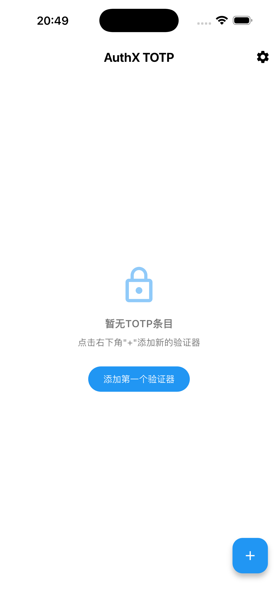
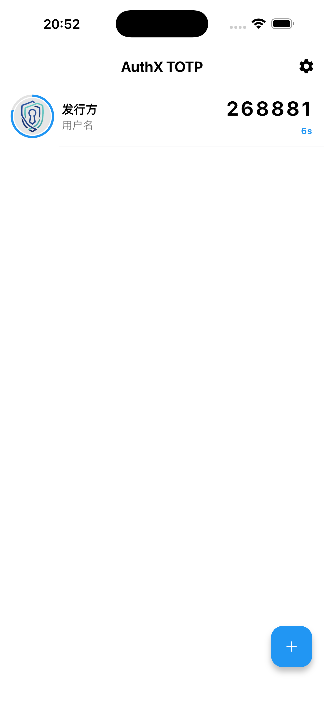
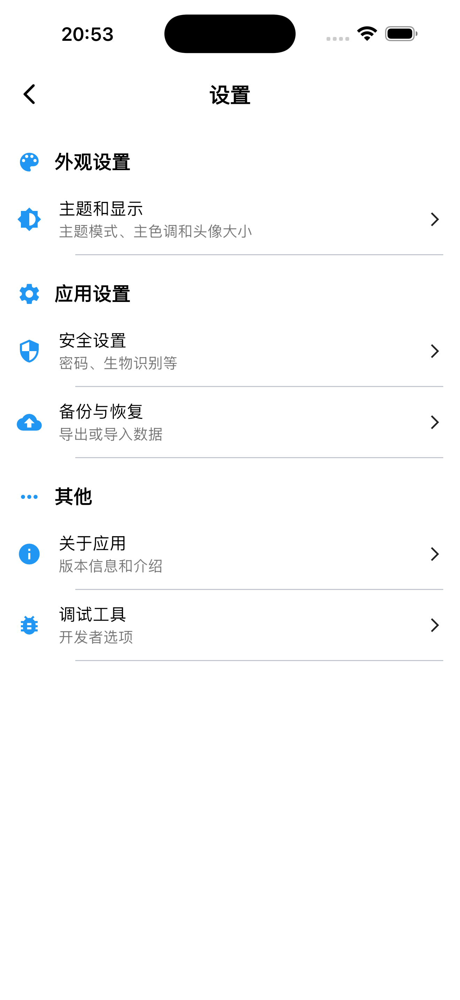

# AuthX TOTP 🔐

<p align="center">
  
</p>

<p align="center">
  <a href="https://github.com/your-username/authx/stargazers">
    
  </a>
  <a href="https://github.com/your-username/authx/issues">
    
  </a>
  <a href="https://github.com/your-username/authx/blob/main/LICENSE">
    
  </a>
</p>

<p align="center">
  一个优雅、安全的开源双因素认证（2FA）应用程序，支持基于时间的一次性密码（TOTP）标准 RFC 6238。🛡️🔐
</p>

<p align="center">
   
   
  
</p>

## 特性 ✨

### 🔒 安全优先
- 所有敏感数据都使用设备级加密安全存储 💾
- 数据永远不会上传到任何服务器 ☁️❌
- 基于 Flutter 和系统原生安全 API 构建 🏗️

### 📱 现代化设计
- 精心设计的 Material Design 3 界面 🎨
- 支持浅色和深色主题模式 🌗
- 流畅的动画和直观的用户体验 🌊

### 🚀 强大功能
- **二维码扫描** - 通过摄像头扫描快速添加账户 📷
- **手动添加** - 手动输入账户信息和密钥 🔤
- **剪贴板导入** - 自动检测并导入剪贴板中的 TOTP 链接 📋
- **URI 导入** - 通过 otpauth:// URI 格式导入账户 🔗
- **自定义图标** - 支持网络图片链接或 Base64 编码图片作为账户图标 🖼️
- **主题设置** - 支持浅色、深色和系统主题模式 🎨
- **实时同步** - 所有验证码实时刷新，与服务器时间同步 ⏱️

### 🛠 技术规格
- 支持算法: SHA1, SHA256, SHA512 🔐
- 验证码位数: 6 位或 8 位 🔢
- 更新周期: 默认 30 秒 🕒
- 跨平台支持: Android, iOS, Windows, macOS, Linux 🌍

## 技术栈 💻

- [Flutter](https://flutter.dev/) - Google 的 UI 工具包，用于构建跨平台应用 🎯
- [Dart](https://dart.dev/) - Flutter 的编程语言 🎯
- [flutter_secure_storage](https://pub.dev/packages/flutter_secure_storage) - 安全存储敏感数据 🔒
- [mobile_scanner](https://pub.dev/packages/mobile_scanner) - 二维码扫描功能 📷
- [provider](https://pub.dev/packages/provider) - 状态管理 📊
- [crypto](https://pub.dev/packages/crypto) - 加密算法实现 🔐

## 安装 ⚙️

### 从源码构建 🏗️

1. 克隆仓库:
```bash
git clone https://github.com/your-username/authx.git
cd authx
```

2. 安装依赖:
```bash
flutter pub get
```

3. 运行应用:
```bash
flutter run
```

4. 构建发布版本:
```bash
# Android
flutter build apk

# iOS
flutter build ios

# Windows
flutter build windows

# macOS
flutter build macos

# Linux
flutter build linux
```

## 使用方法 📖

1. **添加账户** ➕
   - 点击主屏幕右下角的"+"按钮
   - 选择添加方式:
     - **扫描二维码**: 使用摄像头扫描账户的 QR 码 📷
     - **手动添加**: 输入账户信息和密钥 🔤
     - **从剪贴板导入**: 自动检测剪贴板中的 TOTP 链接 📋

2. **使用验证码** 🔑
   - 在主屏幕上找到对应的账户
   - 点击验证码卡片即可复制到剪贴板
   - 在登录页面粘贴使用

3. **个性化设置** ⚙️
   - 进入设置界面调整主题和显示选项 🎨
   - 自定义账户图标和显示名称 🖼️

## 屏幕截图 📸

<div style="display: flex; justify-content: space-around;">
  
  
  
</div>

## 安全性 🛡️

AuthX TOTP 非常重视用户数据的安全性:

- 所有 TOTP 密钥都使用系统级安全存储加密保存 🔒
- 应用没有网络权限，数据不会被上传或共享 🌐❌
- 开源代码可供安全专家审查 👁️
- 遵循 RFC 6238 标准实现 TOTP 算法 📜

## 贡献 💪

欢迎任何形式的贡献！请阅读 [CONTRIBUTING.md](CONTRIBUTING.md) 了解详情。

1. Fork 项目 🍴
2. 创建功能分支 (`git checkout -b feature/AmazingFeature`) 🌿
3. 提交更改 (`git commit -m 'Add some AmazingFeature'`) 💾
4. 推送到分支 (`git push origin feature/AmazingFeature`) 🚀
5. 开启 Pull Request 📬

## 许可证 📄

本项目采用 MIT 许可证 - 查看 [LICENSE](LICENSE) 文件了解详情。

## 鸣谢 🙏

- 感谢所有为开源社区做出贡献的开发者 💻
- 特别感谢 Flutter 团队提供的优秀框架 🎯

---

<p align="center">Made with ❤️ using Flutter</p>